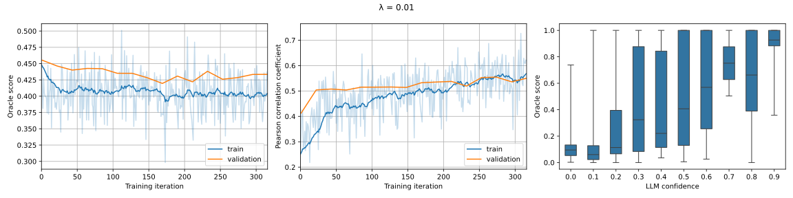

# Can AI Call its Own Bluffs?

The repository provides code for training the models, described in this [project](https://alexisrozhkov.notion.site/Can-AI-Call-its-Own-Bluffs-986fdda302db48c4956374a53a386f43).

## Installation
All experiments were conducted on Google Colab instance with L4 GPU, below is the command to install the required the dependencies:
```bash
! pip install wandb xformers trl peft accelerate bitsandbytes flash-attn evaluate timeout-decorator git+https://github.com/google-research/bleurt.git
```

For reproducibility in the future:
* the Python version used in these experiments is `3.10.12`
* `requirements.txt` is also provided, which is the output of `pip freeze` on the same type of instance

## Experiment Results
Here's a [W&B dashboard](https://wandb.ai/alexisrozhkov/llm-calib/) with all the experiment logs.

Below are some highlighted results:

### Score lambda = 0.01

When a small value of score lambda is used, the proposed alignment procedure is able to improve the calibration on the held-out data.

### Only score

When only oracle score is used as a reward, the proposed alignment procedure is able to improve the oracle score on the held-out data.

### Confidence for ground truth answers
<p float="left">
  
   
</p>

When the model is generating an incorrect answer, if it is prompted with a ground truth answer, the model's confidence on average is higher for models that had a calibration component during the alignment procedure.

## Citation

If this repository is useful for you, please cite as:

```
@misc{arozhkov2024llmcalib,
  author = {Aleksei Rozhkov},
  title = {Can AI Call its Own Bluffs?},
  year = {2024},
  publisher = {GitHub},
  journal = {GitHub repository},
  howpublished = {\url{https://github.com/alexisrozhkov/llm_calib}}
}
```
